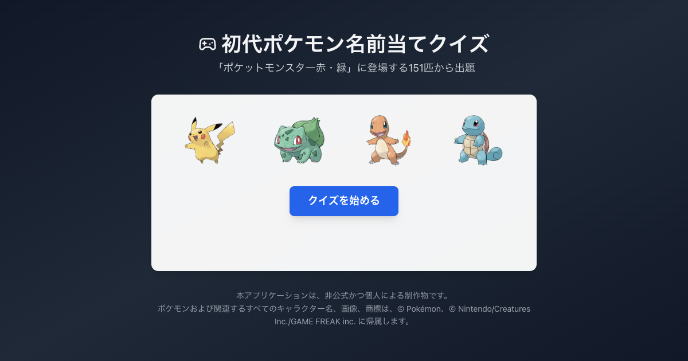

# 初代ポケモン名前当てクイズ

> 子どもの頃に「ポケットモンスター赤・緑」を遊んでいた世代に、懐かしい気持ちになってもらいたくて作りました。

「ポケットモンスター赤・緑」に登場する151匹の中から、ぼかして表示されたポケモンの名前を4択で当てる Web クイズアプリ。全10問の結果をグラフで振り返り、X にシェアできます。

*English version is below.*

## デモ

**▶ [https://quiz-pokemon-151.vercel.app/](https://quiz-pokemon-151.vercel.app/)**

## 主な機能

- **151匹からランダムに10問出題** — 1回のプレイで同じポケモンは出ません
- **ぼかし画像の4択クイズ** — 回答するとその場で正誤と正しい名前が分かります
- **結果のグラフ表示** — 全10問の正誤履歴と、正解数・不正解数をグラフで表示します
- **X へのシェア** — 絵文字（🟢 / ❌）で正誤を並べた結果テキストを生成し、投稿画面を開きます
- **累計プレイ数の表示** — 全ユーザーのプレイ数をサーバー側で保持して表示します

## 技術スタック

| 分類 | 使用技術 |
| --- | --- |
| フロントエンド | React 18 / TypeScript 5 |
| ビルドツール | Vite 5 |
| スタイリング | Tailwind CSS 3 |
| アイコン | Lucide React |
| バックエンド | Vercel Functions（`api/play-count.ts`） |
| データストア | Upstash Redis（`@upstash/redis`） |
| ホスティング | Vercel |
| テスト | Vitest / React Testing Library |

## 使い方

[デモのURL](https://quiz-pokemon-151.vercel.app/) を開いて「クイズを始める」を押すと始まります。

1. ぼかして表示されたポケモンの名前を、4つの選択肢から選ぶ
2. 正誤と正しい名前が表示されるので「次の問題へ」で進む
3. 10問終わると結果画面へ。「もう一度プレイ」で再挑戦、「結果をXでシェア」で投稿できます

## 謝辞・権利表記

本アプリケーションは非公式かつ個人による制作物です。ポケモンおよび関連するすべてのキャラクター名、画像、商標は © Pokémon、© Nintendo/Creatures Inc./GAME FREAK inc. に帰属します。ポケモンの画像データは [PokeAPI](https://pokeapi.co/) から提供されています。

---

# Gen 1 Pokémon Name Quiz

> Built to bring back a bit of nostalgia for the generation that played Pokémon Red and Green as kids.

A web quiz app where you guess which of the 151 Pokémon from Pokémon Red and Green is hidden behind a blurred image, choosing from four options. Review your 10-question run as a graph and share it on X.

## Demo

**▶ [https://quiz-pokemon-151.vercel.app/](https://quiz-pokemon-151.vercel.app/)**

## Features

- **10 random questions from all 151 Pokémon** — no repeats within a single session
- **Blurred-image multiple choice** — instant feedback with the correct name after every answer
- **Graphical results** — full correct/incorrect history for all 10 questions, plus a score graph
- **Share on X** — generates a result text with an emoji summary (🟢 / ❌) and opens the composer
- **Total play count** — the number of plays across all users, kept server-side

## Built with

| Area | Technology |
| --- | --- |
| Frontend | React 18 / TypeScript 5 |
| Build | Vite 5 |
| Styling | Tailwind CSS 3 |
| Icons | Lucide React |
| Backend | Vercel Functions (`api/play-count.ts`) |
| Data store | Upstash Redis (`@upstash/redis`) |
| Hosting | Vercel |
| Testing | Vitest / React Testing Library |

## Usage

Open the [live demo](https://quiz-pokemon-151.vercel.app/) and press "クイズを始める" (Start quiz).

1. Pick the name of the blurred Pokémon from four options
2. The correct name is revealed — press "次の問題へ" (Next question) to continue
3. After 10 questions you reach the results screen, where you can replay or share your result on X

## Acknowledgments

This is an unofficial, personal project. Pokémon and all related names, images and trademarks are © Pokémon, © Nintendo/Creatures Inc./GAME FREAK inc. Pokémon image data is provided by [PokeAPI](https://pokeapi.co/).
